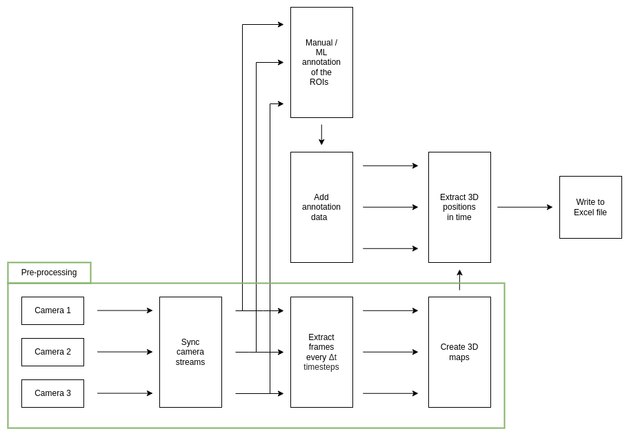
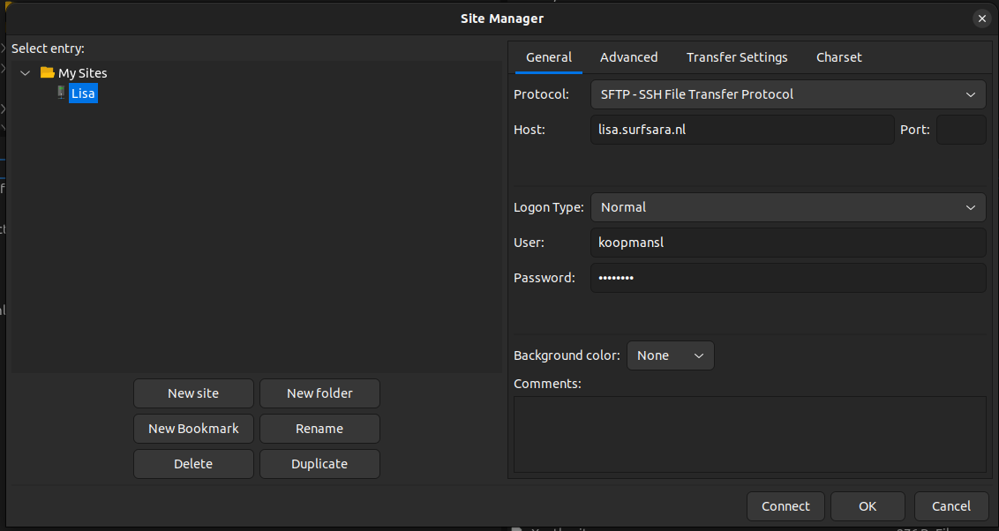

# 3D reconstruction pipeline for the mobile array
Flowchart of the processing pipeline.
<p align="center">
  
</p>

The pre-processing pipeline can be run through the following [notebook](../main/Main_Generate_3D_map.ipynb)
                                                                                                                                                                                                                                                                                                                                                                                                                                                                                                                                                                                                                                                                                                                                                                                                                                                                                                                                                                                                                                                                                                                                                                                                                                                                                                                                                                                                                                                                                                                                                                                                                                                                                                                                                                                                                                                                                                                                                                                                                                                                                                                                                                                                                                                                                                                                                                                                                                                                                                                                                                                                                                                                                                                                                                                                                                                                                                                                                                                                                                                                                                                                                                                                                                                                                                                                                                                                                                                                                                                                                                                                                                                                                                                                                                                                                                                                                                                                                                                                                                                                                                                                                                                                                                                                                                                                                                                                                                                                                                                                                                                                                                                                                                                                                                                                                                                                                                                                                                                                                                                                                                                                                                                                                                                                                                                                                                                                                                                                                                                                                                                                                                                                                                                                                                                                                                                                                                                                                                                                                                                                                                                                                                                                                                                                                                                                                                                                                                                                                                                                                                                                                                                                                                                                                                                                                                        
## Instructions for using the notebook on LISA

### Setting up the packages 
Go to LISA's [jupyter server](https://jupyter.lisa.surfsara.nl/2021/) and login. Open a new terminal session and clone 
the repository.

```
git clone https://github.com/lkoopmans/3D_reconstruction_mobile_array
cd 3D_reconstruction_mobile_array
```
There we can make and activate a virtual environment for the project. 
```
python -m venv venv_3Dmap
source venv_3Dmap/bin/activate
```
Next, we can run the requirements.txt file to install the required packages
```
pip install -r lib/requirements.txt
```
The virtual environment should now be ready to host
```
python -m ipykernel install --user --name=venv_3Dmap
```


### Transfer the video data to LISA
Through filezilla (or another ftp client) we can connect to LISA such that we can upload 
the video data we want to analyse. The correct settings are shown in the figure below.
<p align="center">
  
</p>
The 3 video files can now be added to the "3D_reconstruction_mobile_array" folder in the input folder, together
with its reference number. E.g. "3D_reconstruction_mobile_array/input/131"

### Analyse the data and generate the 3D map
Now we can go to the "Main_Generate_3D_map.ipynb" notebook and set the input parameters. These are described 
in the notebook itself. Here it is important that you select **kernel --> change kernel --> venv_3Dmap** such that 
the packages are available.
